# TCCR — Full Project User Flow

A user-journey diagram of the system, organised by role. The platform is a single
modular monolith (Node.js + Express) on PostgreSQL with Supabase Auth; every
authenticated action passes the `authenticate()` JWT gate before a handler runs.

> Generated from [`TCCR_System_Specification.md`](./TCCR_System_Specification.md).
> Update this diagram whenever a user-facing flow in the specification changes
> (new role journeys, auth steps, or task assignments).

```mermaid
flowchart TD
    Start(["Visitor"]) --> Auth{"Has account?"}

    %% ===== AUTH =====
    Auth -->|No| Register["Register: firstName, lastName, email - Supabase Auth"]
    Register --> VerifyEmail["Supabase sends verification email"]
    VerifyEmail --> Confirm["User confirms email"]
    Confirm --> Login
    Auth -->|Yes| LoginMethod{"Login method"}
    LoginMethod -->|Email password| Pwd["Supabase SDK sign-in"]
    LoginMethod -->|Google or Apple| OAuth["Supabase federated OAuth - pre-verified"]
    Pwd --> Fail{"Credentials OK?"}
    Fail -->|No| Track["Track failed sign-in and lock after threshold"]
    Track --> LoginMethod
    Fail -->|Yes| Login
    OAuth --> Login
    Pwd -.->|forgot| Reset["Password reset email - Supabase"]

    Login["authenticate: verify JWT, email verified, session cap, load roles"] --> Member(["Member dashboard - roles member"])

    %% ===== MEMBER =====
    Member --> ReqStudent["Request to become STUDENT - only self-service request"]
    ReqStudent --> Pending["Status PENDING - visible on dashboard"]
    Pending --> ReviewRR{"Admin or Super Admin approve or reject with note"}
    ReviewRR -->|Approved| BecomeStudent["roles plus student - email and notification"]
    ReviewRR -->|Rejected| Member
    Member --> Notif["View in-app notifications and mark read"]
    Member --> Profile["Edit profile - email read only"]

    %% ===== STUDENT =====
    BecomeStudent --> Student(["Student"])
    Student --> Browse["Browse PUBLISHED courses"]
    Browse --> ReqEnroll["Request enrollment - pending"]
    ReqEnroll --> ReviewEnroll{"Admin or Super Admin approve or reject - profile view optional"}
    ReviewEnroll -->|Approved| Study["Access via OWN BATCH: semesters unscheduled, upcoming, open, closed - subjects - lessons"]
    ReviewEnroll -->|Rejected| Browse
    Study --> Progress["Lesson complete idempotent - auto subject rollup - video position - progress percent"]
    Study --> Download["Download attachments - enrollment gated and time limited"]

    %% ===== ADMIN =====
    Member -.->|assigned by super admin| Admin(["Admin - member plus admin"])
    Admin --> Courses["Course lifecycle: semesters, batches, subjects, lessons, attachments, publish, archive, delete"]
    Courses --> BatchSched["Batches: per-batch per-semester dates - open and close batches - intake window and capacity"]
    Admin --> ReviewRR
    Admin --> ReviewEnroll
    Admin --> AdminUsers["Users: view all, view profile, promote to leader or g12, demote to member, suspend, reactivate, delete"]
    Admin --> AdminCells["Manage cells: transfer ownership leader to leader and g12 to g12, bulk transfer, delete - then demote former owner to member if no cells left"]
    Admin --> AdminCreate["Create user directly: leader or g12 with temp password email"]
    Admin --> Activity["View system activity logs - append only and filterable"]
    Admin --> AdminDash["View dashboard data"]

    %% ===== SUPER ADMIN =====
    Admin -.->|inherited by| SuperAdmin(["Super Admin"])
    SuperAdmin --> SaAdmins["Administrators: invite by email, suspend, reactivate, delete"]
    SuperAdmin --> SaMaster["Master: assign or invite - SINGLETON one active master - view, suspend, reactivate, delete"]
    SuperAdmin --> SaCreate["Create user directly: leader, g12 or master"]
    SuperAdmin --> SaGrant["Grant report access to a G12 only - role unchanged - enables master scope - read only"]

    %% ===== LEADER =====
    Member -.->|promoted| Leader(["Leader - member plus leader"])
    Leader --> LCreate["Create cell: name, area, cellType, select G12 supervisor - add members and unregistered people"]
    Leader --> LViewAll["View all cells - others appearance only"]
    Leader --> LEdit["Own cells: edit ANYTIME - add or remove members and unregistered people - members only, not leaders"]
    LEdit --> LReport["File cell report: add unregistered attendees - location null if no meeting - edit within 24h by filer only"]
    Leader -.->|request student| ReqStudent

    %% ===== G12 LEADER =====
    Member -.->|promoted| G12(["G12 Leader - member plus g12"])
    G12 --> GCreate["Create cell: name, area, cellType - no supervisor - add members, leaders and unregistered people"]
    G12 --> GViewAll["See ALL cells - view only except own"]
    G12 --> GEdit["Own cells: edit ANYTIME - add or remove members, leaders and unregistered people"]
    GEdit --> GReport["File cell report: add unregistered attendees - location null if no meeting - edit within 24h by filer only"]
    G12 --> GSupervised["View only supervised cells"]
    G12 --> GNetwork["Network: view leaders, promote member to leader or g12, promote leader to g12, demote to member"]
    G12 --> GInvite["Invite users leader or g12 with temp password email"]
    G12 --> GReportSummary["Summary report own network - date range and select leaders and cells"]
    G12 -.->|request student| ReqStudent

    %% ===== MASTER =====
    G12 -.->|assigned by super admin singleton| Master2(["Master - member plus master"])
    Master2 --> MG12["All G12 tasks: create and manage cells, members, leaders and unregistered people, file reports, network promote demote, invite, enroll as student"]
    Master2 --> MOrg["Org wide: view all cells, g12s, leaders, reports, attendance - file and void platform wide - promote anywhere - all analytics"]

    %% ===== REPORT SCOPE GATE =====
    GReportSummary --> Scope{"role parameter"}
    SaGrant -.->|enables master scope| Scope
    MOrg --> Scope
    Scope -->|g12| OwnScope["Own network data"]
    Scope -->|master| OrgScope["Org wide data - master or granted G12"]
```

## How to read it

- **Single entry point** — registration and login go through Supabase Auth
  (email/password or Google/Apple); every authenticated request then passes the
  `authenticate()` JWT gate (verify token, email verified, session cap, load
  roles). Failed password sign-ins are tracked and the account is locked after a
  threshold within a window.
- **Roles own tasks, and roles are additive** — a person can be a member,
  student, and leader at once. Dotted arrows ("assigned by", "promoted",
  "inherited by") show how a role is acquired; super admin inherits admin, and
  master inherits all G12 tasks.
- **Members can only self-request the student role** — leader, G12, and master
  are assigned by others (promotion or direct create/invite), never self-served.
  Leaders and G12 leaders take courses by acquiring the student role through the
  same request path (the `request student` dotted arrows).
- **Cells vs. reports** — owned cells can be edited at any time (add/remove
  members, leaders where allowed, and unregistered people); only the cell
  **report** has the 24-hour, author-only edit window. A leader adds members
  only; a G12 leader adds members and leaders.
- **Report scope gate** — the `?role=` parameter is the access gate: `g12`
  returns own-network data, `master` returns org-wide data and is allowed only
  for the master or a G12 granted report access by a super admin (the grant does
  not change the G12's role).
- **Singleton master** — only one active master may exist platform-wide.
